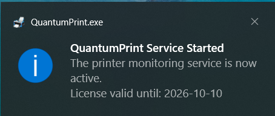
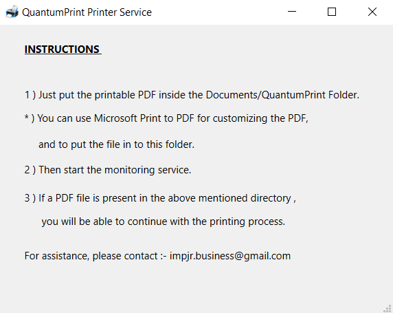

# QuantumPrint

A lightweight Windows tray application that watches a folder for PDF files and sends them to a selected printer with support for manual duplex (two-sided) printing. Built with Qt (Qt 6 preferred) and C++17 using CMake.

> Version: 0.1

## Overview
- Runs as a single-instance background service with a system tray icon.
- Watches `%USERPROFILE%/Documents/QuantumPrint` for new `.pdf` files.
- Prompts you to choose a printer and a print mode per job:
  - Manual Duplex: prints odd pages first, asks you to flip the stack, then prints even pages in reverse order (adds a blank page if needed).
  - Normal: prints all pages single-sided.
- Optional post-print deletion of the processed PDF (enabled by default).
- License-gated: requires activation via a license key.

### Screenshots

|  |  |  |
|---|---|---|
|  |  |  |
|  |  | |


## Features
- Single-instance enforcement using shared memory guard.
- System tray menu: License Information, Change License Key, About, Exit.
- PDF rendering and printing via Qt Pdf + QPrinter (Qt 6).
- Printer selection dialog per print job with stored default printer.
- Graceful handling while files are still being written.

## How It Works
1. On start, the app validates the license. If not activated, a dialog guides you to enter a license key.
2. The main window remains hidden; the app lives in the system tray.
3. A file watcher checks `%USERPROFILE%/Documents/QuantumPrint` every 3 seconds and reacts to changes.
4. When a new PDF is stable (size stops changing), the app:
   - Shows a dialog to choose the printer and print mode.
   - Prints via `QPrinter` and Qt Pdf (`QPdfDocument`), including manual duplex flow when selected.
   - Optionally deletes the PDF after a successful print (default: enabled).

## Requirements
- Windows 10/11 (x64).
- C++17 compiler:
  - MinGW-w64 from Qt tooling, or
  - MSVC (Visual Studio 2022).
- CMake 3.16+.
- Qt:
  - Preferred: Qt 6 with components: Core, Gui, Widgets, Pdf, PrintSupport, Network.
  - Fallback: Qt 5 with Core, Gui, Widgets, PrintSupport, Network (Note: without Qt Pdf, PDF processing is disabled).

## Build (Windows, PowerShell)
Below is a typical MinGW + Ninja flow. Adjust `CMAKE_PREFIX_PATH` to your Qt installation.

```powershell

$qt = "C:\Qt\6.9.2\mingw_64"
cmake -S . -B build -G "Ninja" -DCMAKE_BUILD_TYPE=Release -DCMAKE_PREFIX_PATH="$qt"
cmake --build build --config Release
```

MSVC alternative:
```powershell
$qt = "C:\Qt\6.9.2\msvc2022_64"
cmake -S . -B build -G "Visual Studio 17 2022" -A x64 -DCMAKE_PREFIX_PATH="$qt"
cmake --build build --config Release
```

The primary target is `QuantumPrint` (a GUI executable).

## Run
- Launch `QuantumPrint.exe`. It starts minimized to the system tray.
- Double-click the tray icon to show the window. Closing the window hides it back to tray; use the tray menu to Exit.

## Usage
1. Place a printable `.pdf` into `%USERPROFILE%/Documents/QuantumPrint`.
2. When prompted, select the printer and choose:
   - Manual Duplex: odd pages are printed first. You will be prompted to flip and reinsert the stack; even pages are then printed in reverse order. If the document has an odd number of pages, a blank page is inserted to align sides.
   - Normal (Single-sided): prints all pages in sequence.
3. After a successful print, the source PDF is deleted by default.

## Configuration & Data
- Settings are stored using Qt `QSettings` on Windows registry.
  - App settings: `HKEY_CURRENT_USER\Software\IMPJR\IMPJR_Printer`
    - `PrinterName` (string): last used printer.
    - `DeleteAfterPrint` (bool, default `true`): delete file after successful print.
    - Note: In v0.1, the watch folder and check interval are fixed in code to `%USERPROFILE%/Documents/QuantumPrint` and 3000 ms respectively.
  - License data: `HKEY_CURRENT_USER\Software\IMPJR\QuantumPrint`
    - `LicenseKey` (string)
    - `ActivationDate` (datetime)

## Licensing
- A valid license is required to use the application.
- Open “License Information” or “Change License Key” from the tray menu to manage activation.
- The activation dialog shows your Hardware ID and lets you paste a license key.
- The Hardware ID derives from machine and network interface data. This is used locally for validation and not transmitted by the app.

## Packaging / Deployment
To run on machines without a full Qt installation, deploy dependencies alongside `QuantumPrint.exe`.

- With Qt 6 MinGW, use `windeployqt`:
```powershell
# Example: deploy to a folder next to the built exe
$exeDir = "build"
& "$qt\bin\windeployqt.exe" --release "$exeDir\QuantumPrint.exe"
```
Ensure the `platforms`, `imageformats`, `styles`, and other plugin folders are included. The `exe/` directory in this repo shows a typical Qt runtime layout.

## Troubleshooting
- No printers found: install a printer driver and ensure it appears in Windows Printers & Scanners.
- Printer not valid: the selected printer may have been removed/renamed. Re-select a current printer when prompted.
- Nothing happens after placing a PDF: confirm the file is fully written (the app waits until file size stabilizes). Large files may need extra time.
- App not visible: it runs in the tray; double-click the tray icon. Use “Exit” in the tray menu to quit.
- License not accepted: check for typos. Expired or malformed keys will be rejected.

## Notes & Limitations
- Full PDF printing requires Qt 6 with Qt Pdf. When building against Qt 5, PDF processing is disabled (the watcher will log that Qt Pdf is unavailable).
- The app draws a subtle diagonal guide line on printed pages, intended as a visual alignment cue for manual duplex.
- The watch folder is hardcoded as `%USERPROFILE%/Documents/QuantumPrint` in v0.1.

## Project Layout
- Core:
  - `main.cpp`, `mainwindow.*` — app entry and tray UI
  - `FileWatcher.*` — directory monitoring and print job orchestration
  - `PdfPrinter.*` — PDF rendering/printing (Qt 6 only)
  - `PrinterSelectionDialog.h` — per-job printer/mode prompt
  - `LicenseManager.h`, `LicenseDialog.h` — license verification and activation UI
- Build:
  - `CMakeLists.txt` — Qt 6 first, fallback to Qt 5
  - `resources.qrc`, `resources.rc` — icons and app resources

## Contributing
Issues and pull requests are welcome. Please include reproduction steps and environment details (Qt version, compiler, Windows version).

## Credits
Created by I.M Pasan Ramyanath (2025). For inquiries: `impjr.business@gmail.com`.
